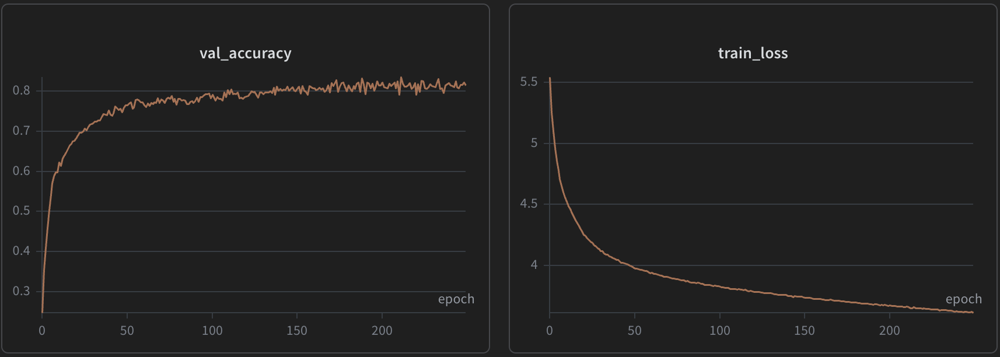
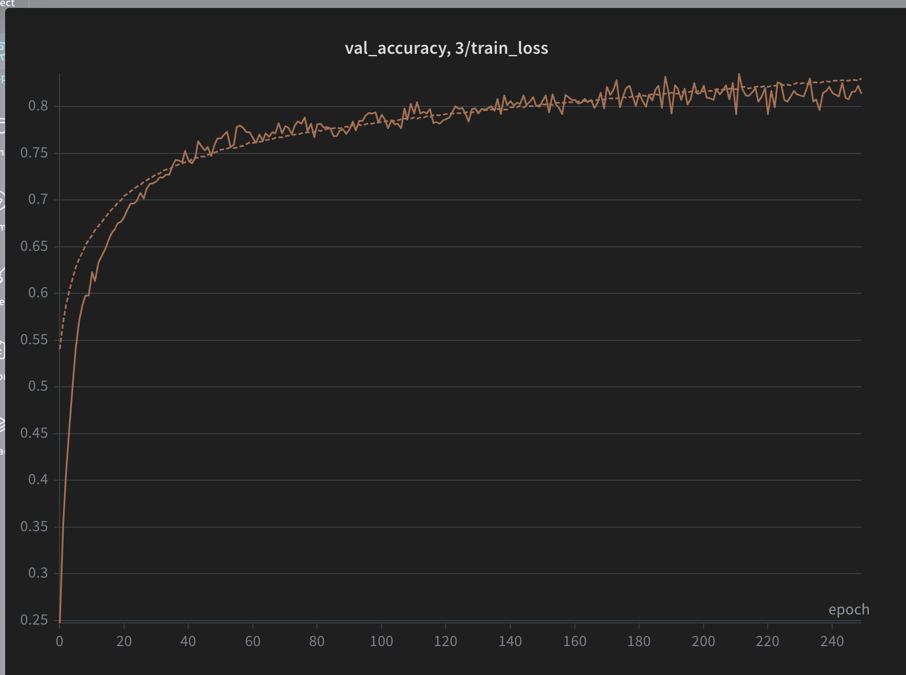
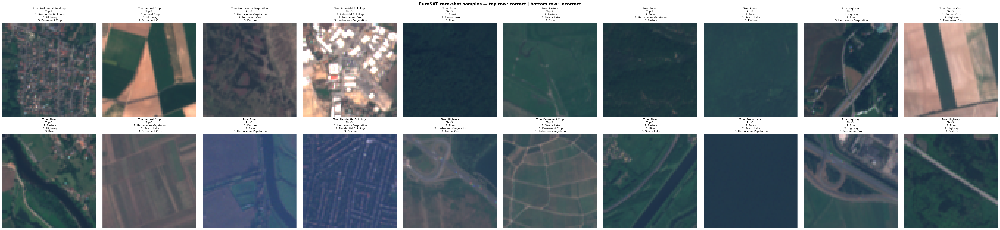
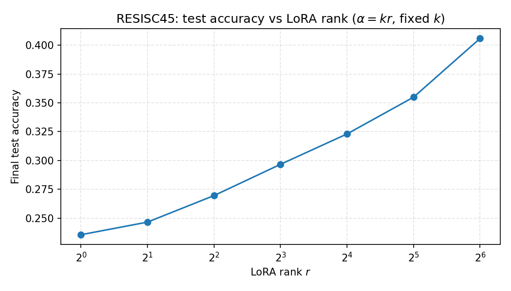

2.4 vit_pooling
The class token compresses a lot of information into a smaller latent dimensional space. It is therefore ideal for global classificaion, but not for tasks like counting, OCR, or visual question answering. For these more complex tasks, we would ideally assimilate all of the information. The vision transformer will likely store various information about the image in different tokens, so an attention-pooling head would best handle this.

2.4 vit_patch_size

(1)
N = (img_size // P)^2 = (224 / P)^2

P =  8 --> N = 784
P = 16 --> N = 196
P = 32 --> N =  49

The attention compute cost is O(N^2 d_model), which is
O(d_model / P^4), so if you halve P, the compute cost goes
up by a factor of 16.

(2)
On my MacBook M2 Max on MPS,
Patch size 8: 0.11446342468261719 ± 0.013505539328942637 seconds
Patch size 16: 0.022238004207611083 ± 0.0036221620536692274 seconds
Patch size 32: 0.01563140153884888 ± 0.00030120027145953823 seconds

(3)
We might accept this tradeoff if our desired downstream tasks rely on high fidelity spatial detail in our representation and we do not need particularly fast inference.

3.2 infonce

The loss is symmetric because the image-text matching problem has two directions: given some image, which is the best-matching caption and given some caption, which is the best-matching image?

3.3 clip_train

Validation accuracy increases in lock step with train accuracy. In fact, val_accuracy = 3/train_loss is almost a perfect fit. Training loss does not really decrease as validation accuracy plateaus, they plateau simultaneously.

3.3 clip_zeroshot

It frequently confuses highways and rivers, which makes sense because they are similar features: dark, long, windining, roughly constant-thickness paths. One image whose true label was "Sea or Lake" was incorrectly classified as a forest, which is unsurprising because the image has a uniform dark blue-green color which resembles a birds-eye view of a dense forest canopy. Mistakes in other categories appeared to be more arbitrary and less sensible. These superficial mistakes tell us that the learned embedding space is capturing some of the simplest visual features like color and shape.

4.2 lora_compare

Here are results from this machine after aligning all three methods to learning rate `1e-4`.

### Results (10 epochs, batch 128, `timm/resisc45` train / `validation` as test)

| Method | Final test accuracy | Trainable params | Peak GPU memory (`torch.cuda.max_memory_allocated`) | Wall-clock train time |
|--------|---------------------|------------------|------------------------------------------------------|------------------------|
| **(1) Linear probe** | 0.215 (21.5%) | 17,325 | 0.41 GiB (435,631,104 B) | 56.5 s |
| **(2) LoRA (r=8, α=16)** | 0.288 (28.8%) | 275,373 | 1.29 GiB (1,387,107,328 B) | 81.7 s |
| **(3) Full fine-tuning** | 0.621 (62.1%) | 10,755,117 | 1.80 GiB (1,928,562,176 B) | 88.5 s |

With a shared `1e-4` LR, full fine-tuning clearly achieved the best accuracy on this split, which matches the intuition that updating every layer lets the backbone adapt to RESISC45’s scene statistics instead of relying only on a frozen CLIP-aligned representation. Linear probing used the fewest trainable parameters, the lowest peak memory, and the shortest run, but accuracy plateaued because the CLS embedding was not updated for the new label space. LoRA sat in the middle: it added only a small fraction of full-model trainable weights yet improved over the linear probe, trading some extra memory and time for more flexible attention than a frozen ViT. Peak memory grew from probe → LoRA → full FT as more parameters participated in the backward graph and optimizer state scaled accordingly; wall time increased modestly in the same order, with most of the extra cost in this setup coming from heavier backward passes rather than epoch count. For a course write-up, if linear probe or LoRA looked unstable at `1e-4`, you would document a per-method LR change; here full FT was already strongest, so no extra tuning was applied. Re-running with your full EuroSAT CLIP checkpoint is recommended so the "starting ViT" matches the homework’s intended §3 model.

4.2 lora_rank

LoRA rank sweep on RESISC45 (10 epochs each, $\alpha = 2r$, same setup as above, ViT from short CLIP bootstrap). Per-rank metrics live under `runs/resisc_lora_rank_sweep/rank_*/metrics.json`; aggregate in `runs/resisc_lora_rank_sweep/sweep_summary.json`.

**(1) Diminishing returns.** Test accuracy rises monotonically from $r=1$ to $r=64$ in this run, with no clear plateau: the curve is still climbing at the largest rank, so a sharp “elbow” is not visible here. The *marginal* gain from doubling rank is somewhat uneven (e.g. similar jumps from $r=4\!\to\!8$ and $r=8\!\to\!16$, then a larger jump $r=32\!\to\!64$), which suggests that if diminishing returns appear, they would likely show up beyond $r=64$, with more epochs, or with a stronger base ViT where the task is easier.

**(2) vs typical ranks ($r=8$–$16$) and effective rank.** In large-model practice, $r=8$ or $16$ is common because adapter cost and merged-rank experiments on huge transformers suggest updates lie in a very low-dimensional subspace. Here, $r=8$ is clearly not near the accuracy ceiling of the sweep, so the fine-tuning update on this ViT and dataset behaves as if it has higher intrinsic rank than those defaults imply—either the adaptation genuinely needs more degrees of freedom at this scale, or the short CLIP pretrain leaves more “slack” for the backbone to move than a near-saturated foundation model. That gap underscores that “typical $r$” is a **heuristic tied to model size, data, and budget**, not a universal intrinsic dimension.

Discussion (summary): The plot shows accuracy increasing roughly sublinearly in $\log r$ without flattening by $r=64$. Compared to production LoRA on multi-billion-parameter models, this smaller ViT benefits from larger $r$ before saturating, which is consistent with a higher effective rank of the weight update relative to the extreme low-rank adapters used at LLM scale, and with the fact that $\alpha/r$ was held fixed so larger $r$ also scales the adapter magnitude.

5.3 projector

Since both the encoder and decoder are frozen during pretraining, the projector is the main trainable adapter responsible for alignment two very different representation spaces. So, a deeper nonlinear projector provides better learning capacity to transform complex features.